# Kaltura API Guides — Map

This document organizes all guides around the **Kaltura flywheel** — the three pillars of the platform: **Creation**, **Management**, and **Experiences**. Use it to find the right guide, understand prerequisites, and navigate the knowledge base.

# Flywheel Structure

## Foundation — Start Here

Every integration begins with authentication. These guides are prerequisites for everything else.

| Guide | What You Learn |
|-------|---------------|
| [API Getting Started](KALTURA_API_GETTING_STARTED.md) | API structure, endpoints, first call, multirequest batching, error handling |
| [Session Guide (KS)](KALTURA_SESSION_GUIDE.md) | KS types, creation methods, privileges, validation, security |
| [AppTokens](KALTURA_APPTOKENS_API.md) | Production auth without exposing secrets, HMAC, scoped tokens |

## Creation — Capturing, Editing & AI Enrichment

Guides for getting content into the platform and enriching it with AI.

| Guide | Subcategory | What You Learn |
|-------|-------------|---------------|
| [Upload & Ingestion](KALTURA_UPLOAD_AND_INGESTION_API.md) | Capturing & Ingestion | Upload, transcode, chunked upload, entry CRUD, flavors, attachments |
| [Content Delivery](KALTURA_CONTENT_DELIVERY_API.md) | Capturing & Ingestion | playManifest, raw serve, download, delivery profiles, CDN, access control |
| [Thumbnail API](KALTURA_THUMBNAIL_API.md) | Capturing & Ingestion | Dynamic thumbnail URL, thumbAsset CRUD, thumbParams |
| [Multi-Stream](KALTURA_MULTI_STREAM_API.md) | Editing & Personalization | Dual-screen / PIP multi-camera entries |
| [Captions & Transcripts](KALTURA_CAPTIONS_AND_TRANSCRIPTS_API.md) | Editing & Personalization | Caption asset CRUD, formats, serving, search |
| [Custom Metadata](KALTURA_CUSTOM_METADATA_API.md) | Editing & Personalization | XSD schemas, structured XML metadata on entries |
| [Cue Points & Interactive Video](KALTURA_CUE_POINTS_API.md) | Editing & Personalization | Temporal metadata hub: base service, eSearch, protocols, bulk ops |
| [Quiz API](KALTURA_QUIZ_API.md) | Editing & Personalization | Interactive video quizzes: questions, scoring, reports, IVQ plugin |
| [Chapters & Slides](KALTURA_CHAPTERS_AND_SLIDES_API.md) | Editing & Personalization | Chapters, slides, timedThumbAsset workflow, navigation plugin |
| [Annotations](KALTURA_ANNOTATIONS_API.md) | Editing & Personalization | Annotations, threaded replies, hotspots, searchableOnEntry |
| [Ad Cue Points](KALTURA_AD_CUE_POINTS_API.md) | Editing & Personalization | VAST/VPAID ad insertion: pre-roll, mid-roll, overlay |
| [Code, Event & Session Cue Points](KALTURA_CODE_CUE_POINTS_API.md) | Editing & Personalization | Code markers, view-change, forceStop, event/session cue points |
| [REACH API](KALTURA_REACH_API.md) | AI Enrichment | Governed enrichment services marketplace: captions, translation, moderation, AI analysis, 22+ services |
| [Agents Manager](KALTURA_AGENTS_MANAGER_API.md) | AI Enrichment | Automated content-processing rules and workflows |
| [AI Genie](KALTURA_AI_GENIE_API.md) | AI Enrichment | Conversational AI / RAG over video library |

## Management — Organization, Intelligence & Orchestration

Guides for organizing content, managing users, controlling access, and connecting systems.

| Guide | Subcategory | What You Learn |
|-------|-------------|---------------|
| [eSearch](KALTURA_ESEARCH_API.md) | Content Management | Full-text search across entries, captions, metadata |
| [Categories & Entitlements](KALTURA_CATEGORIES_AND_ENTITLEMENTS_API.md) | Content Management | Category hierarchy, membership, content assignment, entitlements |
| [Access Control](KALTURA_ACCESS_CONTROL_API.md) | Content Management | Access control profiles, rules, conditions, scheduling |
| [User Management](KALTURA_USER_MANAGEMENT_API.md) | Identity & Access | User CRUD, roles, RBAC |
| [Auth Broker (SSO)](KALTURA_AUTH_BROKER_API.md) | Identity & Access | SAML/OIDC identity provider integration |
| [Multi-Account Management](KALTURA_MULTI_ACCOUNT_MANAGEMENT_API.md) | Administration | Sub-accounts, cross-account auth, aggregated analytics |
| [Analytics Reports](KALTURA_ANALYTICS_REPORTS_API.md) | Intelligence | Pull reports: content, engagement, cross-account |
| [Analytics Events Collection](KALTURA_ANALYTICS_EVENTS_COLLECTION_API.md) | Intelligence | Push playback and engagement events |
| [Moderation](KALTURA_MODERATION_API.md) | Content Management | Content flagging, approve/reject queue, AI moderation via REACH |
| [Webhooks](KALTURA_WEBHOOKS_API.md) | Orchestration | Real-time HTTP callbacks on content events |
| [App Registry](KALTURA_APP_REGISTRY_API.md) | Orchestration | Application instance registration and configuration |
| [Messaging](KALTURA_MESSAGING_API.md) | Orchestration | Template-based email communications |

## Experiences — Playback, Events & Distribution

Guides for delivering content to end users through players, widgets, events, and syndication.

| Guide | Subcategory | What You Learn |
|-------|-------------|---------------|
| [Player Embed](KALTURA_PLAYER_EMBED_GUIDE.md) | Playback & Content Hubs | Iframe/JS player embed, 30+ plugins, playback control |
| [Experience Components](KALTURA_EXPERIENCE_COMPONENTS_API.md) | Playback & Content Hubs | Index of all embeddable components with shared guidelines |
| [Express Recorder](KALTURA_EXPRESS_RECORDER_API.md) | Playback & Content Hubs | Browser-based WebRTC video/audio/screen recording |
| [Captions Editor](KALTURA_CAPTIONS_EDITOR_API.md) | Playback & Content Hubs | Interactive caption editing with video/waveform sync |
| [Conversational Avatar](KALTURA_CONVERSATIONAL_AVATAR_API.md) | Playback & Content Hubs | AI-powered conversational video avatar embed |
| [Chat & Collaborate](KALTURA_CNC_API.md) | Playback & Content Hubs | Real-time chat, Q&A, polls alongside video |
| [Genie Widget](KALTURA_GENIE_WIDGET_API.md) | Playback & Content Hubs | Conversational AI search widget over video library |
| [Media Manager](KALTURA_MEDIA_MANAGER_API.md) | Playback & Content Hubs | Browsable media library: select, upload, manage entries |
| [Content Lab](KALTURA_CONTENT_LAB_API.md) | Playback & Content Hubs | AI content repurposing: summaries, chapters, clips, quizzes |
| [Agents Widget](KALTURA_AGENTS_WIDGET_API.md) | Playback & Content Hubs | Automated content-processing agent management UI |
| [VOD Avatar Studio](KALTURA_VOD_AVATAR_API.md) | Playback & Content Hubs | Pre-recorded avatar video creation: server-side API (CRUD, AI composition, generation) and Unisphere widget embed |
| [Embeddable Analytics](KALTURA_ANALYTICS_EMBED_API.md) | Playback & Content Hubs | Analytics dashboards via iframe + postMessage |
| [Unisphere Framework](KALTURA_UNISPHERE_FRAMEWORK_API.md) | Playback & Content Hubs | Micro-frontend framework: loader, workspace, services |
| [Events Platform](KALTURA_EVENTS_PLATFORM_API.md) | Virtual Events & Webinars | Virtual events, webinars, town halls, sessions |
| [User Profile](KALTURA_USER_PROFILE_API.md) | Virtual Events & Webinars | Per-app user profiles, event attendance tracking |
| [Gamification](KALTURA_GAMIFICATION_API.md) | Virtual Events & Webinars | Leaderboards, badges, certificates |
| [Content Distribution](KALTURA_DISTRIBUTION_API.md) | Distribution & Syndication | Push to YouTube, Facebook, FTP, custom connectors |
| [Syndication Feeds](KALTURA_SYNDICATION_API.md) | Distribution & Syndication | RSS/MRSS/Podcast/Roku XML feeds |

# Dependency Graph

```mermaid
graph TD
    %% Foundation
    GS["API Getting Started"]
    KS["Session Guide"]
    AT["AppTokens"]

    GS --> KS --> AT

    %% Creation
    UD["Upload & Delivery"]
    MS["Multi-Stream"]
    CT["Captions & Transcripts"]
    CM["Custom Metadata"]
    RE["REACH API"]
    AG["Agents Manager"]
    AI["AI Genie"]

    KS --> UD
    UD --> MS
    KS --> CT
    KS --> CM
    KS --> RE
    RE --> AG
    RE --> CT
    KS --> AI
    CP["Cue Points Hub"]
    QZ["Quiz"]
    CS["Chapters & Slides"]
    AN["Annotations"]
    AD["Ad Cue Points"]
    CE["Code/Event/Session CPs"]
    KS --> CP
    UD --> CP
    CP --> QZ
    CP --> CS
    CP --> AN
    CP --> AD
    CP --> CE

    %% Management
    ES["eSearch"]
    CA["Categories & Entitlements"]
    ACL["Access Control"]
    UM["User Management"]
    AB["Auth Broker SSO"]
    MA["Multi-Account Management"]
    AR["Analytics Reports"]
    AE["Analytics Events"]
    WH["Webhooks"]
    APR["App Registry"]
    MSG["Messaging"]

    KS --> ES
    KS --> CA
    KS --> ACL
    KS --> UM
    AT --> AB
    KS --> MA
    AR --> MA
    KS --> AR
    MO["Moderation"]
    KS --> MO
    RE --> MO
    KS --> WH
    KS --> APR
    KS --> MSG

    %% Experiences
    PE["Player Embed"]
    EC["Experience Components"]
    ER["Express Recorder"]
    CE["Captions Editor"]
    CVA["Conv. Avatar"]
    CNC["Chat & Collab"]
    GW["Genie Widget"]
    EA["Embed Analytics"]
    UF["Unisphere Framework"]
    MM["Media Manager"]
    CL["Content Lab"]
    AW["Agents Widget"]
    VA["VOD Avatar Studio"]
    EP["Events Platform"]
    UP["User Profile"]
    GA["Gamification"]
    DI["Distribution"]
    SY["Syndication"]

    KS --> PE
    PE --> AE
    KS --> EC
    EC --> ER
    EC --> CE
    EC --> CVA
    EC --> CNC
    EC --> GW
    EC --> EA
    EC --> UF
    EC --> MM
    EC --> CL
    EC --> AW
    EC --> VA
    UF --> GW
    UF --> MM
    UF --> CL
    UF --> AW
    UF --> VA
    AG --> AW
    RE --> CL
    KS --> EP
    APR --> UP
    EP --> GA
    KS --> DI
    KS --> SY

    %% Cross-links
    CT --> EC
    ES --> AI

    %% Styling
    classDef foundation fill:#4A90D9,color:#fff,stroke:#2C5F8A
    classDef creation fill:#7B68EE,color:#fff,stroke:#5B48CE
    classDef management fill:#F5A623,color:#fff,stroke:#C5861A
    classDef experience fill:#50C878,color:#fff,stroke:#3A9A5A

    class GS,KS,AT foundation
    class UD,MS,CT,CM,RE,AG,AI,CP,QZ,CS,AN,AD,CE creation
    class ES,CA,UM,AB,MA,AR,AE,WH,APR,MSG,MO management
    class PE,EC,ER,CE,CVA,CNC,GW,EA,UF,MM,CL,AW,VA,EP,UP,GA,DI,SY experience
```

**Legend:**  
Blue = Foundation | Purple = Creation | Orange = Management | Green = Experiences

# Decision Tree

**"I want to..."**

| Goal | Start With |
|------|-----------|
| Make my first API call | [API Getting Started](KALTURA_API_GETTING_STARTED.md) |
| Authenticate securely in production | [AppTokens](KALTURA_APPTOKENS_API.md) |
| Upload and transcode video | [Upload & Ingestion](KALTURA_UPLOAD_AND_INGESTION_API.md) |
| Embed a video player | [Player Embed](KALTURA_PLAYER_EMBED_GUIDE.md) |
| Search my content library | [eSearch](KALTURA_ESEARCH_API.md) |
| Add captions or transcripts | [Captions & Transcripts](KALTURA_CAPTIONS_AND_TRANSCRIPTS_API.md) |
| Enrich content with AI (captions, translation, moderation, and more) | [REACH API](KALTURA_REACH_API.md) |
| Build a chatbot over video | [AI Genie](KALTURA_AI_GENIE_API.md) |
| Embed Genie AI search widget | [Genie Widget](KALTURA_GENIE_WIDGET_API.md) |
| Embed composable experiences (multi-runtime) | [Unisphere Framework](KALTURA_UNISPHERE_FRAMEWORK_API.md) |
| Embed a media library or picker | [Media Manager](KALTURA_MEDIA_MANAGER_API.md) |
| Repurpose video with AI (summaries, chapters, clips) | [Content Lab](KALTURA_CONTENT_LAB_API.md) |
| Automate content processing (captions, translation on upload) | [Agents Widget](KALTURA_AGENTS_WIDGET_API.md) or [Agents Manager API](KALTURA_AGENTS_MANAGER_API.md) |
| Generate avatar videos from scripts | [VOD Avatar Studio](KALTURA_VOD_AVATAR_API.md) |
| Record from browser | [Express Recorder](KALTURA_EXPRESS_RECORDER_API.md) |
| Embed a real-time conversational AI avatar | [Conversational Avatar](KALTURA_CONVERSATIONAL_AVATAR_API.md) |
| Embed analytics dashboards | [Embeddable Analytics](KALTURA_ANALYTICS_EMBED_API.md) |
| Edit captions visually | [Captions Editor](KALTURA_CAPTIONS_EDITOR_API.md) |
| Create a virtual event | [Events Platform](KALTURA_EVENTS_PLATFORM_API.md) |
| Send email notifications | [Messaging](KALTURA_MESSAGING_API.md) |
| Get analytics data | [Analytics Reports](KALTURA_ANALYTICS_REPORTS_API.md) |
| Distribute to YouTube/Roku | [Distribution](KALTURA_DISTRIBUTION_API.md) or [Syndication](KALTURA_SYNDICATION_API.md) |
| Manage sub-accounts | [Multi-Account Management](KALTURA_MULTI_ACCOUNT_MANAGEMENT_API.md) |
| React to content events | [Webhooks](KALTURA_WEBHOOKS_API.md) |
| Set up SSO/SAML | [Auth Broker](KALTURA_AUTH_BROKER_API.md) |
| Add custom fields to entries | [Custom Metadata](KALTURA_CUSTOM_METADATA_API.md) |
| Control who sees what | [Access Control](KALTURA_ACCESS_CONTROL_API.md), [Categories & Entitlements](KALTURA_CATEGORIES_AND_ENTITLEMENTS_API.md) |
| Moderate content (flag, approve, reject) | [Moderation](KALTURA_MODERATION_API.md) |
| Screen content with AI for policy violations | [Moderation](KALTURA_MODERATION_API.md) |
| Add chapters to video | [Chapters & Slides](KALTURA_CHAPTERS_AND_SLIDES_API.md) |
| Add annotations or hotspots to video | [Annotations](KALTURA_ANNOTATIONS_API.md) |
| Insert ads (VAST/VPAID) at specific times | [Ad Cue Points](KALTURA_AD_CUE_POINTS_API.md) |
| Build interactive video quizzes | [Quiz](KALTURA_QUIZ_API.md) |
| Sync slides with video playback | [Chapters & Slides](KALTURA_CHAPTERS_AND_SLIDES_API.md) |
| Add code markers or view-change commands | [Code, Event & Session CPs](KALTURA_CODE_CUE_POINTS_API.md) |
| Understand cue point types and base service | [Cue Points Hub](KALTURA_CUE_POINTS_API.md) |
| Generate thumbnails | [Thumbnail API](KALTURA_THUMBNAIL_API.md) |
| Add gamification | [Gamification](KALTURA_GAMIFICATION_API.md) |
