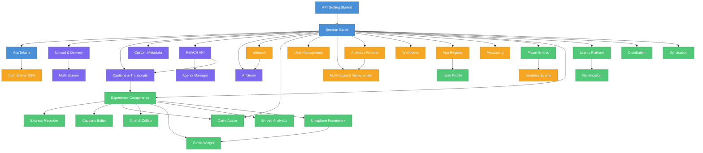

# Kaltura API Guides — Map

This document organizes all guides around the **Kaltura flywheel** — the three pillars of the platform: **Creation**, **Management**, and **Experiences**. Use it to find the right guide, understand prerequisites, and navigate the knowledge base.

# Flywheel Structure

## Foundation — Start Here

Every integration begins with authentication. These guides are prerequisites for everything else.

| Guide | What You Learn |
|-------|---------------|
| [API Getting Started](KALTURA_API_GETTING_STARTED.md) | API structure, endpoints, first call, multirequest batching, error handling |
| [Session Guide (KS)](KALTURA_SESSION_GUIDE.md) | KS types, creation methods, privileges, validation, security |
| [AppTokens](KALTURA_APPTOKENS_API.md) | Production auth without exposing secrets, HMAC, scoped tokens |

## Creation — Capturing, Editing & AI Enrichment

Guides for getting content into the platform and enriching it with AI.

| Guide | Subcategory | What You Learn |
|-------|-------------|---------------|
| [Upload & Delivery](KALTURA_UPLOAD_AND_DELIVERY_API.md) | Capturing & Ingestion | Upload, transcode, thumbnails, chunked upload, delivery URLs |
| [Multi-Stream](KALTURA_MULTI_STREAM_API.md) | Editing & Personalization | Dual-screen / PIP multi-camera entries |
| [Captions & Transcripts](KALTURA_CAPTIONS_AND_TRANSCRIPTS_API.md) | Editing & Personalization | Caption asset CRUD, formats, serving, search |
| [Custom Metadata](KALTURA_CUSTOM_METADATA_API.md) | Editing & Personalization | XSD schemas, structured XML metadata on entries |
| [REACH API](KALTURA_REACH_API.md) | AI Enrichment | AI captioning, translation, enrichment tasks |
| [Agents Manager](KALTURA_AGENTS_MANAGER_API.md) | AI Enrichment | Automated content-processing rules and workflows |
| [AI Genie](KALTURA_AI_GENIE_API.md) | AI Enrichment | Conversational AI / RAG over video library |

## Management — Organization, Intelligence & Orchestration

Guides for organizing content, managing users, controlling access, and connecting systems.

| Guide | Subcategory | What You Learn |
|-------|-------------|---------------|
| [eSearch](KALTURA_ESEARCH_API.md) | Content Management | Full-text search across entries, captions, metadata |
| [Categories & Access Control](KALTURA_CATEGORIES_AND_ACCESS_CONTROL_API.md) | Content Management | Content organization, entitlements, permissions |
| [User Management](KALTURA_USER_MANAGEMENT_API.md) | Identity & Access | User CRUD, roles, RBAC |
| [Auth Broker (SSO)](KALTURA_AUTH_BROKER_API.md) | Identity & Access | SAML/OIDC identity provider integration |
| [Multi-Account Management](KALTURA_MULTI_ACCOUNT_MANAGEMENT_API.md) | Administration | Sub-accounts, cross-account auth, aggregated analytics |
| [Analytics Reports](KALTURA_ANALYTICS_REPORTS_API.md) | Intelligence | Pull reports: content, engagement, cross-account |
| [Analytics Events Collection](KALTURA_ANALYTICS_EVENTS_COLLECTION_API.md) | Intelligence | Push playback and engagement events |
| [Webhooks](KALTURA_WEBHOOKS_API.md) | Orchestration | Real-time HTTP callbacks on content events |
| [App Registry](KALTURA_APP_REGISTRY_API.md) | Orchestration | Application instance registration and configuration |
| [Messaging](KALTURA_MESSAGING_API.md) | Orchestration | Template-based email communications |

## Experiences — Playback, Events & Distribution

Guides for delivering content to end users through players, widgets, events, and syndication.

| Guide | Subcategory | What You Learn |
|-------|-------------|---------------|
| [Player Embed](KALTURA_PLAYER_EMBED_GUIDE.md) | Playback & Content Hubs | Iframe/JS player embed, 30+ plugins, playback control |
| [Experience Components](KALTURA_EXPERIENCE_COMPONENTS_API.md) | Playback & Content Hubs | Index of all embeddable components with shared guidelines |
| [Express Recorder](KALTURA_EXPRESS_RECORDER_API.md) | Playback & Content Hubs | Browser-based WebRTC video/audio/screen recording |
| [Captions Editor](KALTURA_CAPTIONS_EDITOR_API.md) | Playback & Content Hubs | Interactive caption editing with video/waveform sync |
| [Conversational Avatar](KALTURA_CONVERSATIONAL_AVATAR_API.md) | Playback & Content Hubs | AI-powered conversational video avatar embed |
| [Chat & Collaborate](KALTURA_CNC_API.md) | Playback & Content Hubs | Real-time chat, Q&A, polls alongside video |
| [Genie Widget](KALTURA_GENIE_WIDGET_API.md) | Playback & Content Hubs | Conversational AI search widget over video library |
| [Embeddable Analytics](KALTURA_ANALYTICS_EMBED_API.md) | Playback & Content Hubs | Analytics dashboards via iframe + postMessage |
| [Unisphere Framework](KALTURA_UNISPHERE_FRAMEWORK_API.md) | Playback & Content Hubs | Micro-frontend framework: loader, workspace, services, Media Manager |
| [Events Platform](KALTURA_EVENTS_PLATFORM_API.md) | Virtual Events & Webinars | Virtual events, webinars, town halls, sessions |
| [User Profile](KALTURA_USER_PROFILE_API.md) | Virtual Events & Webinars | Per-app user profiles, event attendance tracking |
| [Gamification](KALTURA_GAMIFICATION_API.md) | Virtual Events & Webinars | Leaderboards, badges, certificates |
| [Content Distribution](KALTURA_DISTRIBUTION_API.md) | Distribution & Syndication | Push to YouTube, Facebook, FTP, custom connectors |
| [Syndication Feeds](KALTURA_SYNDICATION_API.md) | Distribution & Syndication | RSS/MRSS/Podcast/Roku XML feeds |

# Dependency Graph

**Legend:**  
Blue = Foundation | Purple = Creation | Orange = Management | Green = Experiences

# Decision Tree

**"I want to..."**

| Goal | Start With |
|------|-----------|
| Make my first API call | [API Getting Started](KALTURA_API_GETTING_STARTED.md) |
| Authenticate securely in production | [AppTokens](KALTURA_APPTOKENS_API.md) |
| Upload and transcode video | [Upload & Delivery](KALTURA_UPLOAD_AND_DELIVERY_API.md) |
| Embed a video player | [Player Embed](KALTURA_PLAYER_EMBED_GUIDE.md) |
| Search my content library | [eSearch](KALTURA_ESEARCH_API.md) |
| Add captions or transcripts | [Captions & Transcripts](KALTURA_CAPTIONS_AND_TRANSCRIPTS_API.md) |
| Auto-caption with AI | [REACH API](KALTURA_REACH_API.md) |
| Build a chatbot over video | [AI Genie](KALTURA_AI_GENIE_API.md) |
| Embed Genie AI search widget | [Genie Widget](KALTURA_GENIE_WIDGET_API.md) |
| Embed composable experiences (Media Manager, multi-runtime) | [Unisphere Framework](KALTURA_UNISPHERE_FRAMEWORK_API.md) |
| Record from browser | [Express Recorder](KALTURA_EXPRESS_RECORDER_API.md) |
| Embed an AI avatar | [Conversational Avatar](KALTURA_CONVERSATIONAL_AVATAR_API.md) |
| Embed analytics dashboards | [Embeddable Analytics](KALTURA_ANALYTICS_EMBED_API.md) |
| Edit captions visually | [Captions Editor](KALTURA_CAPTIONS_EDITOR_API.md) |
| Create a virtual event | [Events Platform](KALTURA_EVENTS_PLATFORM_API.md) |
| Send email notifications | [Messaging](KALTURA_MESSAGING_API.md) |
| Get analytics data | [Analytics Reports](KALTURA_ANALYTICS_REPORTS_API.md) |
| Distribute to YouTube/Roku | [Distribution](KALTURA_DISTRIBUTION_API.md) or [Syndication](KALTURA_SYNDICATION_API.md) |
| Manage sub-accounts | [Multi-Account Management](KALTURA_MULTI_ACCOUNT_MANAGEMENT_API.md) |
| React to content events | [Webhooks](KALTURA_WEBHOOKS_API.md) |
| Set up SSO/SAML | [Auth Broker](KALTURA_AUTH_BROKER_API.md) |
| Add custom fields to entries | [Custom Metadata](KALTURA_CUSTOM_METADATA_API.md) |
| Control who sees what | [Categories & Access Control](KALTURA_CATEGORIES_AND_ACCESS_CONTROL_API.md) |
| Generate thumbnails | [Upload & Delivery](KALTURA_UPLOAD_AND_DELIVERY_API.md) (section 4) |
| Add gamification | [Gamification](KALTURA_GAMIFICATION_API.md) |
