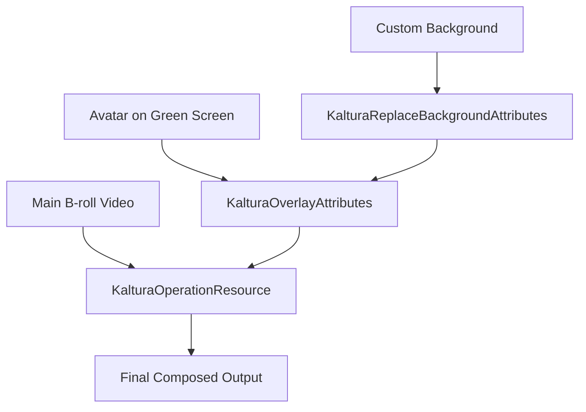

# Kaltura Video Editing API

This guide covers all non-destructive video composition operations: trimming, clipping, multi-clip concatenation, overlays (picture-in-picture), background replacement (chroma key), caption burn-in, fade effects, dimension control, audio mixing, and waveform visualization. All operations use `media.updateContent` (trim in place) or `media.addContent` (create new entry) with operation resource types.

**Base URL:** `$KALTURA_SERVICE_URL` (default: `https://www.kaltura.com/api_v3`)  
**Auth:** All requests require a valid KS (see [Session Guide](KALTURA_SESSION_GUIDE.md))  
**Format:** Form-encoded POST, `format=1` for JSON responses  

<!-- Sections: 1.When to Use | 2.Prerequisites | 3.Core Concepts | 4.Trim | 5.Clip | 6.Multi-Clip Concatenation | 7.Overlay (PiP) | 8.Background Replacement | 9.Nested Composition | 10.Caption Burn-In | 11.Effects | 12.Dimension Control | 13.Audio Mixing | 14.Waveform Visualization | 15.Error Handling | 16.Best Practices | 17.Related Guides -->


# 1. When to Use

| Scenario | What to Use |
|----------|-------------|
| **Trim a video in place** — shorten without changing the entry ID | `media.updateContent` + `KalturaOperationResource` with `KalturaClipAttributes` |
| **Create a clip** — extract a segment to a new entry | `baseEntry.clone` (exclude flavors) + `media.updateContent` on the clone |
| **Concatenate segments** — splice clips from multiple sources | `media.addContent` + `KalturaOperationResources` (plural) |
| **Picture-in-picture** — overlay one video on another | `KalturaOverlayAttributes` in `mediaCompositionAttributesArray` |
| **Green screen removal** — replace background via chroma key | `KalturaReplaceBackgroundAttributes` |
| **Avatar on B-roll** — nested overlay + background replacement | `KalturaOverlayAttributes` with `resourceMediaCompositionAttributesArray` containing `KalturaReplaceBackgroundAttributes` |
| **Burn captions into video** — permanent subtitle render | `KalturaRenderCaptionAttributes` in `captionAttributes` |
| **Fade transitions** — fade in/out between segments | `KalturaEffect` in `effectArray` |
| **Resize / crop** — change aspect ratio or resolution | `KalturaDimensionsAttributes` subtypes |
| **Audio mixing** — blend overlay audio with main video | `audioAttributes` on overlay/background resources |
| **Waveform preview** — get audio amplitude data | `media.getVolumeMap` / `flavorAsset.getVolumeMap` |


# 2. Prerequisites

- **Kaltura Session (KS):** ADMIN KS (type=2) with `disableentitlement` privilege. See [Session Guide](KALTURA_SESSION_GUIDE.md).  
- **FEATURE_ENTRY_REPLACEMENT:** Required for trim operations (`media.updateContent`). Accounts without this feature receive `FEATURE_FORBIDDEN` (one-time setup by your Kaltura account team).  
- **Source entries in READY status (2):** All editing operations require the source entry to be fully transcoded.  
- **Caption asset ID:** For caption burn-in, you need an existing `captionAsset` ID (see [Captions & Transcripts](KALTURA_CAPTIONS_AND_TRANSCRIPTS_API.md)).  


# 3. Core Concepts

## 3.1 Operation Resource Types

| Type | Purpose |
|------|---------|
| `KalturaOperationResource` | Single-source operations: clip, trim, overlay, effects |
| `KalturaOperationResources` (plural) | Multi-source concatenation: splice segments from N entries |
| `KalturaClipAttributes` | Time range selection: offset + duration (milliseconds) |
| `KalturaOverlayAttributes` | Picture-in-picture composition |
| `KalturaReplaceBackgroundAttributes` | Chroma-key background replacement |
| `KalturaRenderCaptionAttributes` | Caption text burn-in to video |
| `KalturaEffect` | Fade in/out transitions |
| `KalturaDimensionsAttributes` | Output resolution/aspect ratio control |

## 3.2 Entry Replacement Flow (Trim)

Trimming uses `media.updateContent` which triggers the **replacement flow** — a safe, non-destructive update pipeline:

1. Call `media.updateContent` with the operation resource
2. Kaltura creates a temporary replacement entry and begins processing
3. The original entry's `replacementStatus` changes from `0` (NONE) to `3` (NOT_READY_AND_NOT_APPROVED)
4. Poll `baseEntry.get` until `replacementStatus` changes to `2` (READY_BUT_NOT_APPROVED)
5. Call `media.approveReplace` to swap the processed content into the original entry
6. The entry returns to `replacementStatus=0` with the new content

**Replacement statuses:**

| Value | Name | Meaning |
|-------|------|---------|
| 0 | NONE | No replacement in progress |
| 1 | APPROVED_BUT_NOT_READY | Approved, still processing |
| 2 | READY_BUT_NOT_APPROVED | Processing complete, awaiting approval |
| 3 | NOT_READY_AND_NOT_APPROVED | Processing, not yet approved |
| 4 | FAILED | Replacement processing failed |

## 3.3 Clip Flow (New Entry)

Creating a clip produces a new entry preserving the original:

1. Call `baseEntry.clone` with `KalturaBaseEntryCloneOptionComponent` (itemType=6, rule=1) to exclude flavors — creates NO_CONTENT clone with metadata
2. Call `media.updateContent` on the cloned entry with `KalturaOperationResource` specifying the time range
3. Poll for the cloned entry to reach READY status

## 3.4 Constraints

| Constraint | Value |
|-----------|-------|
| Maximum clips in concatenation | 5 (configurable per account) |
| Maximum total duration (concat) | 5 hours |
| Concurrent replacements per entry | 1 (returns `ENTRY_REPLACEMENT_ALREADY_EXISTS` if busy) |
| Audio mixing model | Complementary: overlay at `volume`, main at `1-volume` |
| Image sources in composition | Auto-looped with shortest-duration matching |
| Overlay shapes | CIRCLE (1), RECTANGLE (2), RECTANGLE_ROUNDED_CORNERS (3), ELLIPSE (4) |
| Caption color format | ASS format: `&HBBGGRR&` |
| Background color format | Hex: `0xRRGGBB` (default: `0x6FED48` green) |


# 4. Trim (In-Place Content Replacement)

Trim shortens a video without changing its entry ID, embed codes, or analytics history.

## 4.1 Basic Trim

Extract a segment and replace the original content:

```bash
curl -X POST "$KALTURA_SERVICE_URL/service/media/action/updateContent" \
  -d "ks=$KALTURA_KS" \
  -d "format=1" \
  -d "entryId=$KALTURA_ENTRY_ID" \
  -d "resource[objectType]=KalturaOperationResource" \
  -d "resource[resource][objectType]=KalturaEntryResource" \
  -d "resource[resource][entryId]=$KALTURA_ENTRY_ID" \
  -d "resource[resource][flavorParamsId]=0" \
  -d "resource[operationAttributes][0][objectType]=KalturaClipAttributes" \
  -d "resource[operationAttributes][0][offset]=10000" \
  -d "resource[operationAttributes][0][duration]=60000"
```

This trims the entry to a 60-second segment starting at 10 seconds. The source `entryId` in the inner resource points to the same entry being updated.

## 4.2 Poll Replacement Status

```bash
while true; do
  REPLACEMENT=$(curl -s -X POST "$KALTURA_SERVICE_URL/service/baseEntry/action/get" \
    -d "ks=$KALTURA_KS" -d "format=1" -d "entryId=$KALTURA_ENTRY_ID" | jq -r '.replacementStatus')
  echo "replacementStatus: $REPLACEMENT"
  [ "$REPLACEMENT" = "2" ] && break
  [ "$REPLACEMENT" = "4" ] && echo "Replacement failed" && break
  sleep 5
done
```

## 4.3 Approve Replacement

```bash
curl -X POST "$KALTURA_SERVICE_URL/service/media/action/approveReplace" \
  -d "ks=$KALTURA_KS" \
  -d "format=1" \
  -d "entryId=$KALTURA_ENTRY_ID"
```

After approval, the entry's content is replaced with the trimmed version. The entry retains its original ID, metadata, embed URLs, and analytics.


# 5. Clip (Extract Segment to New Entry)

Create a new entry containing a segment from an existing video.

## 5.1 Clone the Entry (Metadata Only)

```bash
curl -X POST "$KALTURA_SERVICE_URL/service/baseEntry/action/clone" \
  -d "ks=$KALTURA_KS" \
  -d "format=1" \
  -d "entryId=$KALTURA_SOURCE_ENTRY_ID" \
  -d "cloneOptions[0][objectType]=KalturaBaseEntryCloneOptionComponent" \
  -d "cloneOptions[0][itemType]=6" \
  -d "cloneOptions[0][rule]=1"
```

The `KalturaBaseEntryCloneOptionComponent` with `itemType=6` (flavors) and `rule=1` (exclude) creates a NO_CONTENT entry (status=7) that inherits the source's metadata, tags, and categories without copying flavors.

## 5.2 Apply Clip Operation

```bash
curl -X POST "$KALTURA_SERVICE_URL/service/media/action/updateContent" \
  -d "ks=$KALTURA_KS" \
  -d "format=1" \
  -d "entryId=$KALTURA_CLONED_ENTRY_ID" \
  -d "resource[objectType]=KalturaOperationResource" \
  -d "resource[resource][objectType]=KalturaEntryResource" \
  -d "resource[resource][entryId]=$KALTURA_SOURCE_ENTRY_ID" \
  -d "resource[resource][flavorParamsId]=0" \
  -d "resource[operationAttributes][0][objectType]=KalturaClipAttributes" \
  -d "resource[operationAttributes][0][offset]=60000" \
  -d "resource[operationAttributes][0][duration]=30000"
```

This populates the cloned entry with a 30-second clip starting at 1:00 from the source.

## 5.3 Alternative: Direct addContent to New Entry

For simpler workflows where you create a fresh entry rather than cloning:

```bash
curl -X POST "$KALTURA_SERVICE_URL/service/media/action/add" \
  -d "ks=$KALTURA_KS" \
  -d "format=1" \
  -d "entry[objectType]=KalturaMediaEntry" \
  -d "entry[mediaType]=1" \
  -d "entry[name]=Clip from Source"
```

Then apply the clip via `addContent`:

```bash
curl -X POST "$KALTURA_SERVICE_URL/service/media/action/addContent" \
  -d "ks=$KALTURA_KS" \
  -d "format=1" \
  -d "entryId=$KALTURA_NEW_ENTRY_ID" \
  -d "resource[objectType]=KalturaOperationResource" \
  -d "resource[resource][objectType]=KalturaEntryResource" \
  -d "resource[resource][entryId]=$KALTURA_SOURCE_ENTRY_ID" \
  -d "resource[resource][flavorParamsId]=0" \
  -d "resource[operationAttributes][0][objectType]=KalturaClipAttributes" \
  -d "resource[operationAttributes][0][offset]=60000" \
  -d "resource[operationAttributes][0][duration]=30000"
```


# 6. Multi-Clip Concatenation

Splice segments from multiple source entries into a single output.

## 6.1 Basic Concatenation (Two Sources)

```bash
curl -X POST "$KALTURA_SERVICE_URL/service/media/action/addContent" \
  -d "ks=$KALTURA_KS" \
  -d "format=1" \
  -d "entryId=$KALTURA_ENTRY_ID" \
  -d "resource[objectType]=KalturaOperationResources" \
  -d "resource[resources][0][objectType]=KalturaOperationResource" \
  -d "resource[resources][0][resource][objectType]=KalturaEntryResource" \
  -d "resource[resources][0][resource][entryId]=$KALTURA_SOURCE_ENTRY_1" \
  -d "resource[resources][0][resource][flavorParamsId]=0" \
  -d "resource[resources][0][operationAttributes][0][objectType]=KalturaClipAttributes" \
  -d "resource[resources][0][operationAttributes][0][offset]=0" \
  -d "resource[resources][0][operationAttributes][0][duration]=10000" \
  -d "resource[resources][1][objectType]=KalturaOperationResource" \
  -d "resource[resources][1][resource][objectType]=KalturaEntryResource" \
  -d "resource[resources][1][resource][entryId]=$KALTURA_SOURCE_ENTRY_2" \
  -d "resource[resources][1][resource][flavorParamsId]=0" \
  -d "resource[resources][1][operationAttributes][0][objectType]=KalturaClipAttributes" \
  -d "resource[resources][1][operationAttributes][0][offset]=0" \
  -d "resource[resources][1][operationAttributes][0][duration]=15000"
```

Output: a new entry with first 10s of source 1 followed by first 15s of source 2.

## 6.2 Chapter Name Policy

When concatenating clips, Kaltura can auto-generate chapter cue points. Control naming with `chapterNamePolicy`:

| Value | Policy | Chapter Names |
|-------|--------|---------------|
| 1 | BY_ENTRY_ID | Source entry IDs as chapter titles |
| 2 | BY_ENTRY_NAME | Source entry names as chapter titles |
| 3 | NUMERICAL | Sequential numbers (1, 2, 3...) |

Add to the request:

```bash
  -d "resource[chapterNamePolicy]=2"
```

## 6.3 Global Offset in Destination

Use `globalOffsetInDestination` (milliseconds) on each clip to control placement timing in the output timeline. Gaps between clips result in black frames.

```bash
  -d "resource[resources][0][operationAttributes][0][globalOffsetInDestination]=0" \
  -d "resource[resources][1][operationAttributes][0][globalOffsetInDestination]=15000"
```

## 6.4 Dimension Normalization

When concatenating sources with different resolutions, use `dimensionsAttributes` on the `KalturaOperationResources` container to normalize output dimensions.

**Crop to aspect ratio:**

```bash
  -d "resource[dimensionsAttributes][objectType]=KalturaAspectRatioCropAttributes" \
  -d "resource[dimensionsAttributes][aspectRatioX]=16" \
  -d "resource[dimensionsAttributes][aspectRatioY]=9"
```

**Scale with letterbox/pillarbox:**

```bash
  -d "resource[dimensionsAttributes][objectType]=KalturaAspectRatioScaleAttributes" \
  -d "resource[dimensionsAttributes][aspectRatioX]=16" \
  -d "resource[dimensionsAttributes][aspectRatioY]=9"
```

**Exact resolution crop:**

```bash
  -d "resource[dimensionsAttributes][objectType]=KalturaResolutionCropAttributes" \
  -d "resource[dimensionsAttributes][width]=1920" \
  -d "resource[dimensionsAttributes][height]=1080"
```


# 7. Overlay (Picture-in-Picture)

Compose one video on top of another at a specified position, size, and shape.

## 7.1 KalturaOverlayAttributes

| Parameter | Type | Description |
|-----------|------|-------------|
| `objectType` | string | `KalturaOverlayAttributes` |
| `resource` | object | Overlay source (KalturaEntryResource or KalturaAssetResource) |
| `overlayPlacement` | int | Position on 9-point grid (see alignment table) |
| `overlayScalePercentage` | float | Size relative to main video (0.1–0.9) |
| `marginsPercentage` | float | Margin from edges (0.1–0.9) |
| `overlayShape` | int | Shape of overlay window |
| `audioAttributes` | object | Audio mixing settings |
| `resourceMediaCompositionAttributesArray` | array | Nested composition (max 1 — for background replacement on the overlay source) |

## 7.2 Overlay Placement (KalturaMediaCompositionAlignment)

| Value | Position |
|-------|----------|
| 1 | Top-Left |
| 2 | Top-Center |
| 3 | Top-Right |
| 4 | Center |
| 6 | Bottom-Left |
| 7 | Bottom-Center |
| 8 | Bottom-Right |

## 7.3 Overlay Shape

| Value | Shape |
|-------|-------|
| 1 | CIRCLE |
| 2 | RECTANGLE |
| 3 | RECTANGLE_ROUNDED_CORNERS |
| 4 | ELLIPSE |

## 7.4 Basic PiP Example

Place a speaker video (circle, bottom-right, 25% size) over the main presentation:

```bash
curl -X POST "$KALTURA_SERVICE_URL/service/media/action/addContent" \
  -d "ks=$KALTURA_KS" \
  -d "format=1" \
  -d "entryId=$KALTURA_ENTRY_ID" \
  -d "resource[objectType]=KalturaOperationResource" \
  -d "resource[resource][objectType]=KalturaEntryResource" \
  -d "resource[resource][entryId]=$KALTURA_MAIN_VIDEO_ENTRY_ID" \
  -d "resource[resource][flavorParamsId]=0" \
  -d "resource[operationAttributes][0][objectType]=KalturaClipAttributes" \
  -d "resource[operationAttributes][0][offset]=0" \
  -d "resource[operationAttributes][0][duration]=60000" \
  -d "resource[operationAttributes][0][mediaCompositionAttributesArray][0][objectType]=KalturaOverlayAttributes" \
  -d "resource[operationAttributes][0][mediaCompositionAttributesArray][0][resource][objectType]=KalturaEntryResource" \
  -d "resource[operationAttributes][0][mediaCompositionAttributesArray][0][resource][entryId]=$KALTURA_OVERLAY_ENTRY_ID" \
  -d "resource[operationAttributes][0][mediaCompositionAttributesArray][0][resource][flavorParamsId]=0" \
  -d "resource[operationAttributes][0][mediaCompositionAttributesArray][0][overlayPlacement]=8" \
  -d "resource[operationAttributes][0][mediaCompositionAttributesArray][0][overlayScalePercentage]=0.25" \
  -d "resource[operationAttributes][0][mediaCompositionAttributesArray][0][marginsPercentage]=0.1" \
  -d "resource[operationAttributes][0][mediaCompositionAttributesArray][0][overlayShape]=1"
```


# 8. Background Replacement (Chroma Key)

Remove a solid-color background from the foreground video and replace it with another video or image.

## 8.1 KalturaReplaceBackgroundAttributes

| Parameter | Type | Description |
|-----------|------|-------------|
| `objectType` | string | `KalturaReplaceBackgroundAttributes` |
| `resource` | object | Background source (KalturaEntryResource, KalturaAssetResource, or KalturaUrlResource) |
| `backgroundColorCode` | string | Color to key out, format `0xRRGGBB` (default: `0x6FED48` — Kaltura green) |
| `foregroundScalePercentage` | float | Scale factor for keyed foreground (0–5, default 1.0) |
| `foregroundPositionPercentage` | object | Position of foreground: `{x: 0-1, y: 0-1}` (KalturaPosition) |
| `audioAttributes` | object | Audio mixing for background source |

## 8.2 Basic Green Screen Replacement

Replace a green background with a custom background video:

```bash
curl -X POST "$KALTURA_SERVICE_URL/service/media/action/addContent" \
  -d "ks=$KALTURA_KS" \
  -d "format=1" \
  -d "entryId=$KALTURA_ENTRY_ID" \
  -d "resource[objectType]=KalturaOperationResource" \
  -d "resource[resource][objectType]=KalturaEntryResource" \
  -d "resource[resource][entryId]=$KALTURA_GREEN_SCREEN_ENTRY_ID" \
  -d "resource[resource][flavorParamsId]=0" \
  -d "resource[operationAttributes][0][objectType]=KalturaClipAttributes" \
  -d "resource[operationAttributes][0][offset]=0" \
  -d "resource[operationAttributes][0][duration]=30000" \
  -d "resource[operationAttributes][0][mediaCompositionAttributesArray][0][objectType]=KalturaReplaceBackgroundAttributes" \
  -d "resource[operationAttributes][0][mediaCompositionAttributesArray][0][resource][objectType]=KalturaEntryResource" \
  -d "resource[operationAttributes][0][mediaCompositionAttributesArray][0][resource][entryId]=$KALTURA_BACKGROUND_ENTRY_ID" \
  -d "resource[operationAttributes][0][mediaCompositionAttributesArray][0][resource][flavorParamsId]=0" \
  -d "resource[operationAttributes][0][mediaCompositionAttributesArray][0][backgroundColorCode]=0x6FED48"
```

## 8.3 Custom Foreground Position and Scale

Position the keyed foreground at center-bottom, scaled to 60%:

```bash
  -d "resource[operationAttributes][0][mediaCompositionAttributesArray][0][foregroundScalePercentage]=0.6" \
  -d "resource[operationAttributes][0][mediaCompositionAttributesArray][0][foregroundPositionPercentage][x]=0.5" \
  -d "resource[operationAttributes][0][mediaCompositionAttributesArray][0][foregroundPositionPercentage][y]=0.8"
```

## 8.4 Using an Image as Background

Image resources (JPEG, PNG) are auto-looped to match the foreground video duration via FFmpeg's `-loop 1` with `shortest=1`:

```bash
  -d "resource[operationAttributes][0][mediaCompositionAttributesArray][0][resource][objectType]=KalturaUrlResource" \
  -d "resource[operationAttributes][0][mediaCompositionAttributesArray][0][resource][url]=https://example.com/office-background.jpg"
```


# 9. Nested Composition (Overlay + Background Replacement)

The most advanced composition pattern: an avatar video recorded on green screen, with the green replaced by a custom background, then overlaid on a main B-roll video.

## 9.1 Architecture



The nesting structure:
- Outer: `KalturaOperationResource` with main video as source
- Level 1: `KalturaOverlayAttributes` in `mediaCompositionAttributesArray` — the avatar
- Level 2: `KalturaReplaceBackgroundAttributes` in the overlay's `resourceMediaCompositionAttributesArray` — removes green from avatar and adds background

## 9.2 Full Example

```bash
curl -X POST "$KALTURA_SERVICE_URL/service/media/action/addContent" \
  -d "ks=$KALTURA_KS" \
  -d "format=1" \
  -d "entryId=$KALTURA_ENTRY_ID" \
  -d "resource[objectType]=KalturaOperationResource" \
  -d "resource[resource][objectType]=KalturaEntryResource" \
  -d "resource[resource][entryId]=$KALTURA_MAIN_BROLL_ENTRY_ID" \
  -d "resource[resource][flavorParamsId]=0" \
  -d "resource[operationAttributes][0][objectType]=KalturaClipAttributes" \
  -d "resource[operationAttributes][0][offset]=0" \
  -d "resource[operationAttributes][0][duration]=60000" \
  -d "resource[operationAttributes][0][mediaCompositionAttributesArray][0][objectType]=KalturaOverlayAttributes" \
  -d "resource[operationAttributes][0][mediaCompositionAttributesArray][0][resource][objectType]=KalturaEntryResource" \
  -d "resource[operationAttributes][0][mediaCompositionAttributesArray][0][resource][entryId]=$KALTURA_AVATAR_GREEN_SCREEN_ENTRY_ID" \
  -d "resource[operationAttributes][0][mediaCompositionAttributesArray][0][resource][flavorParamsId]=0" \
  -d "resource[operationAttributes][0][mediaCompositionAttributesArray][0][overlayPlacement]=8" \
  -d "resource[operationAttributes][0][mediaCompositionAttributesArray][0][overlayScalePercentage]=0.3" \
  -d "resource[operationAttributes][0][mediaCompositionAttributesArray][0][marginsPercentage]=0.05" \
  -d "resource[operationAttributes][0][mediaCompositionAttributesArray][0][overlayShape]=1" \
  -d "resource[operationAttributes][0][mediaCompositionAttributesArray][0][resourceMediaCompositionAttributesArray][0][objectType]=KalturaReplaceBackgroundAttributes" \
  -d "resource[operationAttributes][0][mediaCompositionAttributesArray][0][resourceMediaCompositionAttributesArray][0][resource][objectType]=KalturaUrlResource" \
  -d "resource[operationAttributes][0][mediaCompositionAttributesArray][0][resourceMediaCompositionAttributesArray][0][resource][url]=https://example.com/virtual-office.jpg" \
  -d "resource[operationAttributes][0][mediaCompositionAttributesArray][0][resourceMediaCompositionAttributesArray][0][backgroundColorCode]=0x6FED48" \
  -d "resource[operationAttributes][0][mediaCompositionAttributesArray][0][resourceMediaCompositionAttributesArray][0][foregroundScalePercentage]=1.0"
```

## 9.3 Audio in Nested Compositions

Audio flows from all layers. Use `audioAttributes` to control mixing:

```bash
  -d "resource[operationAttributes][0][mediaCompositionAttributesArray][0][audioAttributes][volume]=0.7"
```

This sets the overlay (avatar) audio to 70% and the main video audio to 30% (complementary model: main = 1 - overlay volume).


# 10. Caption Burn-In

Render caption text permanently into the video frame. Useful for social media distribution where players may not support subtitle tracks.

## 10.1 KalturaRenderCaptionAttributes

| Parameter | Type | Description |
|-----------|------|-------------|
| `objectType` | string | `KalturaRenderCaptionAttributes` |
| `captionAssetId` | string | ID of the captionAsset to burn in (required) |
| `fontSize` | int | Font size in pixels |
| `fontColor` | string | Text color in ASS format: `&HBBGGRR&` |
| `fontName` | string | Font family name |
| `positionX` | int | Horizontal position (pixels from left) |
| `positionY` | int | Vertical position (pixels from top) |
| `borderStyle` | int | 1=OUTLINE, 3=OPAQUE_BOX |
| `borderColor` | string | Border/box color in ASS format |
| `bold` | int | Bold weight (0=normal, 1=bold) |
| `italic` | int | Italic (0=normal, 1=italic) |

## 10.2 ASS Color Format

Colors use `&HBBGGRR&` (hex, blue-green-red reversed from RGB):

| Color | ASS Value |
|-------|-----------|
| White | `&H00FFFFFF&` |
| Black | `&H00000000&` |
| Yellow | `&H0000FFFF&` |
| Red | `&H000000FF&` |

## 10.3 Burn-In Example

```bash
curl -X POST "$KALTURA_SERVICE_URL/service/media/action/addContent" \
  -d "ks=$KALTURA_KS" \
  -d "format=1" \
  -d "entryId=$KALTURA_ENTRY_ID" \
  -d "resource[objectType]=KalturaOperationResource" \
  -d "resource[resource][objectType]=KalturaEntryResource" \
  -d "resource[resource][entryId]=$KALTURA_SOURCE_ENTRY_ID" \
  -d "resource[resource][flavorParamsId]=0" \
  -d "resource[operationAttributes][0][objectType]=KalturaClipAttributes" \
  -d "resource[operationAttributes][0][offset]=0" \
  -d "resource[operationAttributes][0][duration]=60000" \
  -d "resource[operationAttributes][0][captionAttributes][objectType]=KalturaRenderCaptionAttributes" \
  -d "resource[operationAttributes][0][captionAttributes][captionAssetId]=$KALTURA_CAPTION_ASSET_ID" \
  -d "resource[operationAttributes][0][captionAttributes][fontSize]=24" \
  -d "resource[operationAttributes][0][captionAttributes][fontColor]=&H00FFFFFF&" \
  -d "resource[operationAttributes][0][captionAttributes][borderStyle]=1" \
  -d "resource[operationAttributes][0][captionAttributes][borderColor]=&H00000000&"
```


# 11. Effects (Fade In/Out)

Apply video fade transitions to clips.

## 11.1 KalturaEffect

| Parameter | Type | Description |
|-----------|------|-------------|
| `effectType` | int | 1 = VIDEO_FADE_IN, 2 = VIDEO_FADE_OUT |
| `value` | string | Duration of the effect in seconds (as string) |

## 11.2 Fade Example

Apply a 2-second fade-in and 3-second fade-out to a clip:

```bash
curl -X POST "$KALTURA_SERVICE_URL/service/media/action/addContent" \
  -d "ks=$KALTURA_KS" \
  -d "format=1" \
  -d "entryId=$KALTURA_ENTRY_ID" \
  -d "resource[objectType]=KalturaOperationResource" \
  -d "resource[resource][objectType]=KalturaEntryResource" \
  -d "resource[resource][entryId]=$KALTURA_SOURCE_ENTRY_ID" \
  -d "resource[resource][flavorParamsId]=0" \
  -d "resource[operationAttributes][0][objectType]=KalturaClipAttributes" \
  -d "resource[operationAttributes][0][offset]=0" \
  -d "resource[operationAttributes][0][duration]=30000" \
  -d "resource[operationAttributes][0][effectArray][0][effectType]=1" \
  -d "resource[operationAttributes][0][effectArray][0][value]=2" \
  -d "resource[operationAttributes][0][effectArray][1][effectType]=2" \
  -d "resource[operationAttributes][0][effectArray][1][value]=3"
```


# 12. Dimension Control

Control output resolution when composing or concatenating sources with different dimensions.

## 12.1 Dimension Attribute Types

| Type | Behavior |
|------|----------|
| `KalturaAspectRatioCropAttributes` | Crops source to target aspect ratio (removes edges) |
| `KalturaAspectRatioScaleAttributes` | Scales to fit target ratio with letterbox/pillarbox (adds black bars) |
| `KalturaResolutionCropAttributes` | Crops to exact pixel dimensions |

## 12.2 Parameters

**KalturaAspectRatioCropAttributes / KalturaAspectRatioScaleAttributes:**

| Parameter | Type | Description |
|-----------|------|-------------|
| `aspectRatioX` | int | Width ratio component (e.g., 16) |
| `aspectRatioY` | int | Height ratio component (e.g., 9) |

**KalturaResolutionCropAttributes:**

| Parameter | Type | Description |
|-----------|------|-------------|
| `width` | int | Target width in pixels |
| `height` | int | Target height in pixels |

## 12.3 Usage

Dimension attributes apply to `KalturaOperationResources` (multi-clip concat) via the `dimensionsAttributes` field:

```bash
curl -X POST "$KALTURA_SERVICE_URL/service/media/action/addContent" \
  -d "ks=$KALTURA_KS" \
  -d "format=1" \
  -d "entryId=$KALTURA_ENTRY_ID" \
  -d "resource[objectType]=KalturaOperationResources" \
  -d "resource[dimensionsAttributes][objectType]=KalturaAspectRatioCropAttributes" \
  -d "resource[dimensionsAttributes][aspectRatioX]=16" \
  -d "resource[dimensionsAttributes][aspectRatioY]=9" \
  -d "resource[resources][0][objectType]=KalturaOperationResource" \
  -d "resource[resources][0][resource][objectType]=KalturaEntryResource" \
  -d "resource[resources][0][resource][entryId]=$KALTURA_SOURCE_ENTRY_1" \
  -d "resource[resources][0][resource][flavorParamsId]=0" \
  -d "resource[resources][0][operationAttributes][0][objectType]=KalturaClipAttributes" \
  -d "resource[resources][0][operationAttributes][0][offset]=0" \
  -d "resource[resources][0][operationAttributes][0][duration]=10000" \
  -d "resource[resources][1][objectType]=KalturaOperationResource" \
  -d "resource[resources][1][resource][objectType]=KalturaEntryResource" \
  -d "resource[resources][1][resource][entryId]=$KALTURA_SOURCE_ENTRY_2" \
  -d "resource[resources][1][resource][flavorParamsId]=0" \
  -d "resource[resources][1][operationAttributes][0][objectType]=KalturaClipAttributes" \
  -d "resource[resources][1][operationAttributes][0][offset]=0" \
  -d "resource[resources][1][operationAttributes][0][duration]=10000"
```


# 13. Audio Mixing

Audio from overlay and background replacement sources mixes with the main video using a **complementary volume model**.

## 13.1 Volume Model

| Setting | Main Audio | Overlay/BG Audio |
|---------|-----------|-----------------|
| `volume=0.0` | 100% | 0% (muted) |
| `volume=0.3` | 70% | 30% |
| `volume=0.5` | 50% | 50% |
| `volume=0.7` | 30% | 70% |
| `volume=1.0` | 0% (muted) | 100% |

The formula: main volume = `1 - overlay volume`. Mixed with FFmpeg `amix` filter (normalize=0).

## 13.2 Audio Attributes

Add `audioAttributes` to any overlay or background replacement:

```bash
  -d "resource[operationAttributes][0][mediaCompositionAttributesArray][0][audioAttributes][volume]=0.3"
```

This plays the overlay audio at 30% and the main video audio at 70%.

## 13.3 Muting Overlay Audio

To keep only the main video's audio:

```bash
  -d "resource[operationAttributes][0][mediaCompositionAttributesArray][0][audioAttributes][volume]=0.0"
```


# 14. Waveform Visualization

Retrieve audio amplitude data for building visual waveform displays (useful for editing UIs).

## 14.1 media.getVolumeMap

```bash
curl -X POST "$KALTURA_SERVICE_URL/service/media/action/getVolumeMap" \
  -d "ks=$KALTURA_KS" \
  -d "format=1" \
  -d "entryId=$KALTURA_ENTRY_ID"
```

**Response:** CSV text with two columns per line: `pts,rms_level`

```
0.000000,-48.2
0.023220,-35.1
0.046440,-28.7
...
```

## 14.2 Resampling

Use `desiredLines` to resample the waveform to a specific number of data points:

```bash
curl -X POST "$KALTURA_SERVICE_URL/service/media/action/getVolumeMap" \
  -d "ks=$KALTURA_KS" \
  -d "format=1" \
  -d "entryId=$KALTURA_ENTRY_ID" \
  -d "desiredLines=200"
```

## 14.3 flavorAsset.getVolumeMap

Get waveform for a specific transcoded rendition:

```bash
curl -X POST "$KALTURA_SERVICE_URL/service/flavorAsset/action/getVolumeMap" \
  -d "ks=$KALTURA_KS" \
  -d "format=1" \
  -d "flavorId=$KALTURA_FLAVOR_ASSET_ID"
```


# 15. Error Handling

| Error Code | Meaning | Resolution |
|------------|---------|------------|
| `FEATURE_FORBIDDEN` | Account lacks `FEATURE_ENTRY_REPLACEMENT` | Required for trim/updateContent operations (one-time setup by your Kaltura account team) |
| `ENTRY_REPLACEMENT_ALREADY_EXISTS` | Entry already has a pending replacement | Wait for current replacement to complete or fail, then retry |
| `ENTRY_ID_NOT_FOUND` | Source entry does not exist | Verify the entry ID is correct and not deleted |
| `FLAVOR_ASSET_ID_NOT_FOUND` | Specified flavor does not exist on the source entry | Omit `flavorParamsId` to use the default source, or verify available flavors via `flavorAsset.list` with `entryIdEqual` |
| `INVALID_ENTRY_STATUS` | Source entry is not in READY status | Wait for source entry processing to complete (status=2) |
| `ENTRY_REPLACEMENT_FAILED` (replacementStatus=4) | Processing of the replacement content failed | Check source content validity; retry the operation |
| `MAX_CLIP_COUNT_EXCEEDED` | Too many clips in concatenation | Default limit is 5 clips; reduce segment count or request limit increase |
| `MAX_DURATION_EXCEEDED` | Concatenated output exceeds maximum | Default limit is 5 hours total; shorten segments |

**Retry strategy:** For `ENTRY_REPLACEMENT_ALREADY_EXISTS`, poll `baseEntry.get` until `replacementStatus` returns to `0` (NONE), then retry. For transient HTTP errors, use exponential backoff (1s, 2s, 4s) with up to 3 retries.


# 16. Best Practices

- **Use `baseEntry.clone` + `media.updateContent` for clips.** This preserves the source entry's metadata on the clip and creates a clean separation between the original and the extracted segment.  
- **Use `media.updateContent` for trim (in-place).** This preserves entry ID, embed codes, analytics history, and all associated metadata. Always complete the replacement flow with `media.approveReplace`.  
- **Verify source entries are READY (status=2) before editing.** All operation resources require fully transcoded source content. Poll `media.get` if the source was recently uploaded.  
- **Omit `flavorParamsId` for maximum quality.** When omitted, the system uses the entry's source flavor. Specify a `flavorParamsId` only when you need a particular transcoded rendition as the editing source. Use `flavorAsset.list` with `entryIdEqual` to discover available flavors.  
- **Set clip duration explicitly.** Always specify both `offset` and `duration` in milliseconds. Omitting duration results in undefined behavior.  
- **Use complementary audio volume model intentionally.** Setting overlay volume to 0.7 means main video drops to 0.3 — plan audio levels accordingly.  
- **Use `desiredLines` for waveform resampling.** Match the number of data points to your UI's pixel width for efficient rendering.  
- **Process one replacement at a time per entry.** The API enforces single-replacement locking. Queue sequential edits and wait for each to complete.  
- **Use dimension normalization for multi-source concat.** When splicing sources with different resolutions, set `dimensionsAttributes` to avoid unexpected output dimensions.  
- **Use `KalturaAspectRatioScaleAttributes` over crop when preserving content matters.** Crop removes pixels; scale adds black bars but preserves the full frame.  
- **Burn captions for social distribution.** Use `KalturaRenderCaptionAttributes` when distributing to platforms that strip subtitle tracks (Instagram, TikTok-style sharing).  
- **Use ASS color format correctly.** Colors are `&HBBGGRR&` (reversed from RGB). White is `&H00FFFFFF&`, not `#FFFFFF`.  


# 17. Related Guides

- **[Upload & Ingestion API](KALTURA_UPLOAD_AND_INGESTION_API.md)** — Getting content into Kaltura: upload, import, resource types, entry CRUD  
- **[Content Delivery API](KALTURA_CONTENT_DELIVERY_API.md)** — Serve and download edited content via playManifest and CDN  
- **[Captions & Transcripts API](KALTURA_CAPTIONS_AND_TRANSCRIPTS_API.md)** — Manage caption assets for burn-in operations  
- **[Multi-Stream API](KALTURA_MULTI_STREAM_API.md)** — Multi-camera entries (complementary to overlay/PiP)  
- **[VOD Avatar Studio](KALTURA_VOD_AVATAR_API.md)** — AI avatar video generation (source content for green-screen composition)  
- **[REACH API](KALTURA_REACH_API.md)** — Auto-generate captions for burn-in, or trigger enrichment after editing  
- **[Agents Manager](KALTURA_AGENTS_MANAGER_API.md)** — Automate editing workflows (trigger on ENTRY_READY)  
- **[Thumbnail API](KALTURA_THUMBNAIL_API.md)** — Generate thumbnails from edited entries  
- **[Session Guide](KALTURA_SESSION_GUIDE.md)** — KS generation for API authentication  
