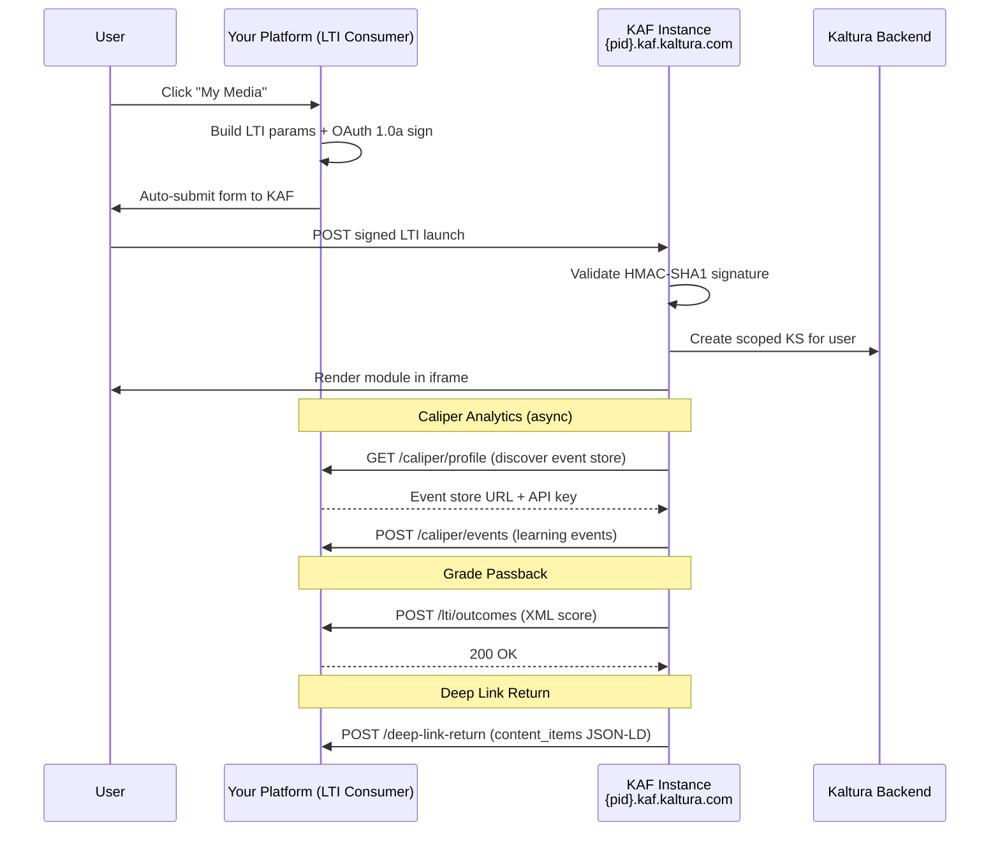

# Build an LTI Platform that Integrates Kaltura Video

Embed Kaltura's full video experience (upload, browse, embed, quiz, analytics) into any LTI-compliant platform — LMS, LXP, training portal, or custom application. This playbook demonstrates the complete implementation: LTI 1.1 launch signing, Caliper learning analytics ingestion, grade passback, deep linking return, and SIS provisioning — all orchestrated through a working Flask application.

**Complexity:** Advanced  
**APIs Used:** [Session](../KALTURA_SESSION_GUIDE.md), [Categories & Entitlements](../KALTURA_CATEGORIES_AND_ENTITLEMENTS_API.md), [User Management](../KALTURA_USER_MANAGEMENT_API.md), [Analytics Events](../KALTURA_ANALYTICS_EVENTS_COLLECTION_API.md), [Upload & Ingestion](../KALTURA_UPLOAD_AND_INGESTION_API.md)  
**Time to Implement:** 2–4 days for core LTI launch; 1–2 weeks for full pipeline (Caliper, grades, deep linking, SIS sync)  
**Prerequisites:** Kaltura account with KAF instance (ltigeneric profile), Partner ID + Admin Secret, Python 3.8+ with Flask

<!-- Sections: 1.Use Cases | 2.Architecture | 3.LTI Launch Signing | 4.Module Configuration | 5.Caliper Analytics | 6.Grade Passback | 7.Deep Linking | 8.SIS Provisioning | 9.Monitoring & Troubleshooting | 10.Testing & Validation -->

# 1. Use Cases

## Education — Custom LMS or LXP

A university building a custom learning experience platform needs to embed Kaltura's video workflows (My Media, Media Gallery, Content Picker, Interactive Video Quizzes) without adopting a full commercial LMS. The LTI integration gives them pre-built video UX with course-scoped content isolation, quiz grading, and learning analytics — no video UI development required.

## Enterprise — Training Portal with Video Assignments

A corporate training platform needs instructors to assign video content, track completion via Caliper analytics, and sync quiz scores to the internal gradebook. KAF modules handle the video experience while the platform owns the user identity, course structure, and grade records.

## Media/Telecom — Partner Content Delivery Portal

A media company provides video content to partner organizations through a branded portal. Each partner gets their own course context (content isolation), with analytics flowing back to demonstrate engagement. The Content Picker enables curated content selection, and Caliper events feed viewership dashboards.

# 2. Architecture Overview



**Decision: LTI 1.1 vs LTI 1.3**

| Approach | When to Use | Trade-off |
|----------|------------|-----------|
| LTI 1.1 (OAuth 1.0a HMAC-SHA1) | Quick prototype, legacy platforms, simpler implementation | Shared secret model; no service-to-service auth for AGS/NRPS |
| LTI 1.3 (JWT/OIDC) | Production deployments, platforms requiring AGS grade passback | More complex (OIDC flow, key management), but stronger security |
| Both simultaneously | KAF supports dual-version from one instance | No trade-off — KAF auto-detects version from request |

This playbook implements LTI 1.1 for clarity. KAF accepts both versions from the same instance — upgrading to 1.3 requires adding OIDC endpoints and JWT signing on your platform side.

# 3. LTI Launch Signing (Phase 1)

Every KAF module launch is an OAuth 1.0a signed POST. Your platform constructs the parameters, signs with HMAC-SHA1, and renders an auto-submitting HTML form.

## 3.1 Core LTI Parameters

Every launch requires these standard parameters:

| Parameter | Value | Purpose |
|-----------|-------|---------|
| `lti_message_type` | `basic-lti-launch-request` | Identifies this as a standard LTI launch |
| `lti_version` | `LTI-1p0` | LTI version identifier |
| `resource_link_id` | `{unique_per_placement}` | Identifies this specific tool placement |
| `user_id` | `{platform_user_id}` | User identity (maps to Kaltura userId) |
| `roles` | `Instructor` or `Learner` | LIS role — determines permissions in KAF |
| `context_id` | `{course_id}` | Course context — KAF creates a category per unique context_id |
| `context_title` | `{course_name}` | Human-readable course name |
| `tool_consumer_instance_guid` | `{platform_domain}` | Identifies your platform instance |
| `launch_presentation_locale` | `en` | UI language |

## 3.2 OAuth 1.0a Signing

```bash
# The signing process (pseudocode — see app.py for full implementation):
# 1. Add OAuth params: consumer_key (partner_id), timestamp, nonce, signature_method, version
# 2. Sort all params alphabetically
# 3. Build base string: "POST&{percent_encode(url)}&{percent_encode(sorted_params)}"
# 4. Sign with HMAC-SHA1 using "{percent_encode(admin_secret)}&" as key
# 5. Base64-encode the signature
```

**Launch URL construction:**

```
https://{PARTNER_ID}.kaf.kaltura.com/{module_endpoint}
```

## 3.3 Module Endpoints

| Module | Endpoint | Notes |
|--------|----------|-------|
| My Media | `/hosted/index/my-media` | Personal media library |
| Media Gallery | `/hosted/index/course-gallery` | Course-scoped shared gallery |
| Content Picker | `/browseandembed/index/browseandembed` | Select content for embedding (uses ContentItemSelectionRequest) |
| Genie AI | `/genie` | Conversational AI search (requires `GlobalSiteGenie=1`) |
| Avatar Studio | `/avatarvodstudio/index/index` | Avatar video generation (requires `allowedRoles=privateOnlyRole`) |
| Meeting Room | `/embeddedrooms/index/view-room` | Entry-based meeting rooms |

Modules with their own KAF admin tab use their own route prefix (`/genie`, `/avatarvodstudio/...`, `/embeddedrooms/...`). Only standard views go through `/hosted/index/`.

## 3.4 Module-Specific Parameters

**Meeting Room** requires additional custom parameters:

| Parameter | Value | Purpose |
|-----------|-------|---------|
| `roles` | `Instructor` | Must be Instructor for moderator access |
| `custom_entry_id` | `{room_entry_id}` | The entry ID of the meeting room |
| `custom_room_moderator` | `1` | Grants moderator rights |

Rooms are regular Kaltura entries (type=meeting) created through KAF's My Media interface.

**Content Picker** uses a different LTI message type:

| Parameter | Value |
|-----------|-------|
| `lti_message_type` | `ContentItemSelectionRequest` |
| `content_item_return_url` | `{your_platform_url}/deep-link-return` |
| `accept_media_types` | `application/vnd.ims.lti.v1.ltilink` |
| `accept_presentation_document_targets` | `iframe,window` |

## 3.5 Shared Repository

Shared Repository is **not a standalone LTI placement**. It appears as a tab within the Content Picker when enabled in KAF Admin:

1. In `/admin/config/tab/hosted`: click "Enable Shared Repository" to create the backing category
2. In `/admin/config/tab/channels`: enable channels module, set `channelCreatorSharedRepository=viewerRole`
3. The "Shared Repository" tab appears automatically in the Content Picker interface

# 4. Module Configuration (Phase 2)

## 4.1 KAF Admin Settings

Each module requires specific KAF Admin configuration. Access the admin panel at `https://{PARTNER_ID}.kaf.kaltura.com/admin`.

| Module | Admin Path | Required Settings |
|--------|-----------|-------------------|
| My Media | `/admin/config/tab/hosted` | Default — works out of the box |
| Media Gallery | `/admin/config/tab/hosted` | Default — works out of the box |
| Content Picker | `/admin/config/tab/browseandembed` | Module enabled (default) |
| Genie AI | `/admin/config/tab/genieai` | `GlobalSiteGenie=1` |
| Avatar Studio | `/admin/config/tab/avatarvodstudio` | `allowedRoles=privateOnlyRole` (or lower) |
| Meeting Room | `/admin/config/tab/embeddedrooms` | Module enabled |
| Caliper | `/admin/config/tab/caliper` | `directCaliperIntegration=No` |

## 4.2 Network Requirements

KAF loads components from multiple Kaltura domains. Ensure all are allowlisted:

- `*.kaf.kaltura.com` — KAF instance
- `*.kaltura.com` — API and CDN
- `unisphere.*.ovp.kaltura.com` — Modern UI components (Genie, Content Lab, Avatar Studio)

## 4.3 Cross-Origin Considerations

Chrome's Local Network Access policy blocks public sites (`*.kaltura.com`) from redirecting to `localhost`. Features that redirect back to your platform (Content Picker return, Express Capture save) require a public HTTPS URL.

**Decision: Development URL approach**

| Approach | When to Use | Trade-off |
|----------|------------|-----------|
| cloudflared tunnel | Local development, quick prototyping | Free, ephemeral URL, easy setup |
| ngrok | Team development, stable URLs needed | Paid for custom domains, more features |
| Deployed staging server | Pre-production testing | Permanent URL, requires infrastructure |

For local development:
```bash
cloudflared tunnel --config /dev/null --url http://localhost:5050
PUBLIC_URL=https://xxxx.trycloudflare.com python app.py
```

The `--config /dev/null` flag prevents existing `~/.cloudflared/config.yml` from interfering.

My Media, Media Gallery, Genie AI, Avatar Studio, and Meeting Room work on localhost without a tunnel. Only features that redirect back to your app require the public URL.

# 5. Caliper Analytics (Phase 3)

IMS Caliper 1.2 provides structured learning analytics events. Your platform acts as a Learning Record Store (LRS), receiving events from KAF in real time.

## 5.1 Discovery Flow

On every LTI launch, include these parameters:

| Parameter | Value | Purpose |
|-----------|-------|---------|
| `custom_caliper_profile_url` | `{base_url}/caliper/profile` | KAF calls this to discover your event store |
| `custom_caliper_federated_session_id` | `session_{user_id}_{nonce}` | Correlates analytics to the LTI session |

KAF calls your profile URL to discover the event store configuration, then pushes events to the store URL.

## 5.2 Profile Endpoint

Your platform exposes a profile endpoint that returns event store configuration:

```json
{
  "id": "your-platform-lrs",
  "type": "EventStore",
  "apiUrl": "{base_url}/caliper/events",
  "apiKey": "{your_api_key}",
  "sendEvents": true,
  "includeActors": true,
  "includeGeneratedValues": true
}
```

## 5.3 Event Endpoint

KAF POSTs Caliper event payloads to your event store URL with an `Authorization` header containing the API key from your profile response.

Event types you receive:

| Event Type | Trigger |
|-----------|---------|
| `MediaEvent` | Video play, pause, seek, complete |
| `NavigationEvent` | User navigates within KAF module |
| `AssessmentEvent` | Quiz start, submit |
| `AssessmentItemEvent` | Individual question answered |
| `SessionEvent` | Login/logout from KAF |
| `ViewEvent` | Page/entry viewed |

## 5.4 KAF Configuration

In KAF Admin at `/admin/config/tab/caliper`:
- Set `directCaliperIntegration=No` — your platform provides the profile URL via LTI launch, not KAF directly

The Caliper profile URL must be accessible from KAF's servers. For local development, use the cloudflared tunnel (`PUBLIC_URL`).

# 6. Grade Passback (Phase 4)

Interactive Video Quizzes (IVQ) pass scores back to your platform's gradebook via LTI Basic Outcomes.

## 6.1 LTI Parameters for Grade Passback

Include these in every launch where grade passback is needed:

| Parameter | Value | Purpose |
|-----------|-------|---------|
| `lis_outcome_service_url` | `{base_url}/lti/outcomes` | Your grade receiving endpoint |
| `lis_result_sourcedid` | `{context_id}:{user_id}:{resource_id}` | Unique identifier for this grade record |

## 6.2 Outcomes Endpoint

KAF sends an XML `replaceResultRequest` POST to your `lis_outcome_service_url`:

```xml
<?xml version="1.0" encoding="UTF-8"?>
<imsx_POXEnvelopeRequest xmlns="http://www.imsglobal.org/services/ltiv1p1/xsd/imsoms_v1p0">
  <imsx_POXBody>
    <replaceResultRequest>
      <resultRecord>
        <sourcedGUID>
          <sourcedId>{lis_result_sourcedid}</sourcedId>
        </sourcedGUID>
        <result>
          <resultScore>
            <textString>0.85</textString>
          </resultScore>
        </result>
      </resultRecord>
    </replaceResultRequest>
  </imsx_POXBody>
</imsx_POXEnvelopeRequest>
```

Scores are normalized 0.0–1.0. Your endpoint parses the XML, extracts the score and sourcedId, and updates your gradebook.

## 6.3 Response

Return a success response:

```xml
<?xml version="1.0" encoding="UTF-8"?>
<imsx_POXEnvelopeResponse xmlns="http://www.imsglobal.org/services/ltiv1p1/xsd/imsoms_v1p0">
  <imsx_POXHeader>
    <imsx_POXResponseHeaderInfo>
      <imsx_version>V1.0</imsx_version>
      <imsx_messageIdentifier>{unique_id}</imsx_messageIdentifier>
      <imsx_statusInfo>
        <imsx_codeMajor>success</imsx_codeMajor>
      </imsx_statusInfo>
    </imsx_POXResponseHeaderInfo>
  </imsx_POXHeader>
  <imsx_POXBody>
    <replaceResultResponse/>
  </imsx_POXBody>
</imsx_POXEnvelopeResponse>
```

**Note:** The `ltigrading` KAF module (which handles AGS/LTI 1.3 grade passback) is included in LMS-specific profiles (Canvas, Moodle, etc.) but NOT in `ltigeneric`. With ltigeneric, use LTI 1.1 Basic Outcomes by providing `lis_outcome_service_url` in the launch.

# 7. Deep Linking (Phase 5)

The Content Picker uses `ContentItemSelectionRequest` to let users select videos for embedding.

## 7.1 Launch with Deep Linking

Set `lti_message_type` to `ContentItemSelectionRequest` instead of `basic-lti-launch-request`. Include `content_item_return_url` pointing to your return handler.

## 7.2 Return Handler

When the user selects content, KAF POSTs `content_items` JSON-LD back to your `content_item_return_url`:

```json
{
  "@context": "http://purl.imsglobal.org/ctx/lti/v1/ContentItem",
  "@graph": [{
    "@type": "LtiLinkItem",
    "url": "https://{pid}.kaf.kaltura.com/browseandembed/index/media/entryid/{entry_id}",
    "title": "Video Title",
    "text": "Description",
    "thumbnail": {
      "@id": "https://cfvod.kaltura.com/p/{pid}/sp/{pid}00/thumbnail/entry_id/{entry_id}/version/100001"
    }
  }]
}
```

## 7.3 iframe Navigation Challenge

The deep-link return POSTs inside the KAF iframe, but your app needs the data at the top level. Solutions:

1. **Base64 URL params:** Encode the POST data into the return URL so it survives the iframe-to-top navigation
2. **iframe buster script:** Use JavaScript to break out of the iframe and pass data to the parent window
3. **postMessage:** Listen for `window.postMessage` from the KAF iframe

The sample app uses approach #1 (base64 URL params) for maximum compatibility.

# 8. SIS Provisioning (Phase 6)

Pre-provision courses and enrollment from your Student Information System before the first LTI launch.

## 8.1 Create a Course Category

```bash
curl -X POST "$KALTURA_SERVICE_URL/service/category/action/add" \
  -d "ks=$KALTURA_KS" \
  -d "format=1" \
  -d "category[name]=COURSE_CS101_Fall2026" \
  -d "category[description]=Introduction to Computer Science"
```

KAF maps `context_id` from LTI launches to category names. Pre-creating ensures the category exists before the first user launch.

## 8.2 Enroll a Student

```bash
curl -X POST "$KALTURA_SERVICE_URL/service/categoryUser/action/add" \
  -d "ks=$KALTURA_KS" \
  -d "format=1" \
  -d "categoryUser[categoryId]=$COURSE_CATEGORY_ID" \
  -d "categoryUser[userId]=student@university.edu" \
  -d "categoryUser[permissionLevel]=0"
```

Permission levels: `0`=MEMBER (view), `2`=MODERATOR (manage content), `3`=MANAGER (manage members).

## 8.3 Assign Content to a Course

```bash
curl -X POST "$KALTURA_SERVICE_URL/service/categoryEntry/action/add" \
  -d "ks=$KALTURA_KS" \
  -d "format=1" \
  -d "categoryEntry[categoryId]=$COURSE_CATEGORY_ID" \
  -d "categoryEntry[entryId]=$KALTURA_ENTRY_ID"
```

# 9. Monitoring & Troubleshooting

## 9.1 Production Monitoring

| What to Monitor | How | Alert Threshold |
|----------------|-----|-----------------|
| LTI signature failures | Log OAuth validation errors | >1% failure rate |
| Caliper event delivery | Track events received vs expected | No events for >5 min during active sessions |
| Grade passback failures | HTTP status from KAF score posts | Any non-2xx response |
| iframe load time | Performance timing on KAF iframe | >5 seconds |
| KAF instance health | `GET https://{pid}.kaf.kaltura.com/version` | Non-200 response |

## 9.2 Common Failure Modes

| Symptom | Cause | Fix |
|---------|-------|-----|
| "Access Denied" on module | Wrong KAF path or role not mapped | Verify module endpoint in §3.3; check `ltiRolesMapping` in KAF Admin |
| "Application Error" on Meeting Room | Wrong entry ID or wrong module path | Use `/embeddedrooms/index/view-room` with valid `custom_entry_id` |
| Content Picker video doesn't render on return | Cross-origin redirect blocked | Use cloudflared tunnel with `PUBLIC_URL` |
| Caliper events not appearing | Profile URL not reachable from KAF servers | Use tunnel so KAF can reach your `/caliper/profile` and `/caliper/events` |
| Grade not received | `lis_outcome_service_url` not reachable from KAF | Use tunnel; verify endpoint returns proper XML response |
| Media Gallery shows "No media" | Different `user_id` across launches | Use consistent user_id for all launches in a session |
| Module works in browser but not via LTI | `allowedRoles` restricts access | Set `allowedRoles=privateOnlyRole` in module's admin tab |
| Shared Repository not visible | Not enabled in KAF Admin | Enable via Content Picker; it's a tab, not a standalone launch |
| OAuth signature mismatch | Clock skew or wrong secret | Ensure server time within 5 min of UTC; verify admin_secret |

## 9.3 Polling and Timeouts

- **KAF iframe load:** Allow 10 seconds before showing error state
- **Caliper profile discovery:** KAF retries profile URL fetch 3 times with 5-second intervals
- **Grade passback:** KAF retries on transient failures; your endpoint should respond within 5 seconds

# 10. Testing & Validation

## 10.1 Automated E2E Test

The companion test at `playbooks/lti-sample-app/test_app.py` validates:

- Dashboard structure and navigation
- LTI launches to all 6 modules (My Media, Media Gallery, Content Picker, Genie AI, Avatar Studio, Meeting Room)
- Course context isolation
- Educational pages (How It Works, Grade Sync, Standalone Embed)
- SIS provisioning API (create course, enroll student)
- Brand compliance (Lato font, Stream Blue, Brand Black)
- Non-technical language (no OAuth/HMAC jargon on user-facing pages)

```bash
cd "playbooks/lti-sample-app"
pip install flask requests playwright
python -m playwright install chromium
python app.py &
python test_app.py
```

## 10.2 Manual Verification

1. **Launch each module** — verify KAF renders correctly in iframe
2. **Upload a video** via My Media — verify it appears in Media Gallery for same course context
3. **Open Content Picker** — select a video and verify the deep-link return data arrives
4. **Take a quiz** (IVQ) — verify score appears at your grade passback endpoint
5. **Check Caliper dashboard** — verify MediaEvent, NavigationEvent flow during video playback
6. **Create a course via SIS API** — verify it appears as a category in Kaltura

## 10.3 Reference Implementation

The full working implementation lives at `playbooks/lti-sample-app/`:

| File | Purpose |
|------|---------|
| `app.py` | Complete Flask application — LTI signing, Caliper LRS, grade passback, deep linking, SIS API |
| `test_app.py` | Playwright E2E test suite |
| `README.md` | Detailed setup, configuration, and troubleshooting guide |

Run the sample app:

```bash
cd "playbooks/lti-sample-app"
pip install flask requests
python app.py
# Open http://localhost:5050
```

For full functionality (Content Picker return, Caliper from KAF servers):

```bash
cloudflared tunnel --config /dev/null --url http://localhost:5050
PUBLIC_URL=https://xxxx.trycloudflare.com python app.py
```
